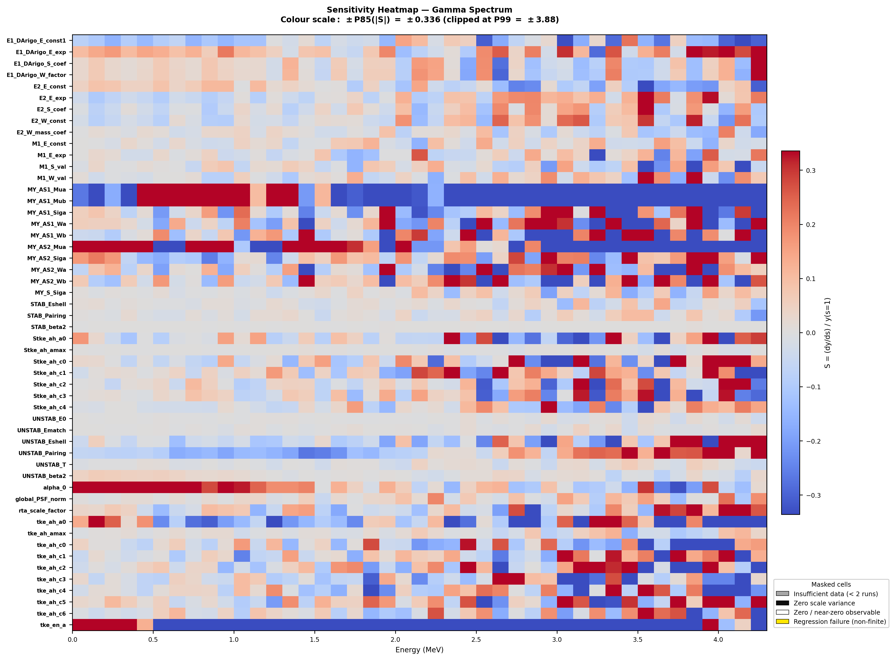

# CGMF_UQ

## Overview

A python wrapper to perform uncertainty quantification within the fission de-excitation code CGMF. Intended for use generating internal model parameter senstivity coefficients against secondary particle observables (PFNS, nubar, etc.). Randomly generated output histories will be generated in the future using sampling across these model parameters to generate randomly perturbed prompt fission gamma spectra.

CGMF is a code which simulates prompt fission neutron and gamma emission from excited fission fragments right after scission using Hauser-Feschbach statistical decay.

**CGMF main repository:** https://github.com/lanl/CGMF

For the purposes of this project, a fork of CGMF has been made which parametrizes gamma strength function 'magic numbers' and places them in `gstrength_gdr_params.dat`.

The purpose of this repository is to provide a wrapper through which randomly perturbed CGMF calculations can be performed. Perturbations are carried out by manipulating `.dat` files within CGMF. Final orchestration scripts are written for a SLURM batch environment.

## Supported Data Files

Model parameters are adjusted by manipulating .dat files within /CGMF/data

This project includes the following specific `.dat` files at the time of writing:

- **`gstrength_gdr_params.dat`**  
  Gamma strength function and giant dipole resonance parameters

- **`tkemodel.dat`**  
  TKE parameterisation against neutron energy and fragment mass

- **`spinscalingmodel.dat`**  
  Spin cutoff parameters in fragment angular momenta distributions

- **`rta.dat`**  
  Light–Heavy fragment temperature ratios

- **`yamodel.dat`**  
  Fragment mass yield parameterisations

- **`kcksyst.dat`**  
  Fragment level density parameterisation

- **`deformations.dat`**  
  Beta2 deformations of nuclei


## Project Phases

Full worflow performed in two phases:

1. **Phase 1:** Parameter Sensitivity Testing
2. **Phase 2:** Random Parameter Sampling (COMING SOON)

## Results

Typical output of per-run post-processing script for 100 000  events of thermal neutron induced fission of U-235, ~ 1.5 CPU hours on Intel Skylake.


Sensitivity coefficients of model parameters with respect to prompt fission neutron and prompt gamma emission spectra for thermal neutron induced fission of U-235. 4 x 100 000 events per paramter, ~ 550 CPU hours total on Intel Skylake. Both spectra have large sensitivities to the parameterisation of TKE and fragment yields.




## How To Run

**Project Download**

`git clone https://github.com/billlx1/cgmf_uq.git`

**Parameter Sensitivity Testing**

copy `run_submit_sensitivity.sh` to your run directory. This is a simple wrapper wich can be used to easily input the arguments of `submit_sensitivity.py`, which include the following:
- `--registry           Path to Parameter_Registry.yaml
- `--sensitivity        Path to Sensitivity_Coeff.yaml`
- `--output             Path to desired results directory` 
- `--project-dir        Path to PROJECT_ROOT` 
- `--cgmf-root          Path to CGMF_GDR_PARAMS installation` 
- `--cgmf-default-data  Path to default CGMF data directory` 
- `----target-id        ZAID of target nucleus`
- `--events             Number of fission events per job`
- `--incident-e         Incident neutron energy` 
- `--max-concurrent     Max number of cores used concurrently` 
- `--time-limit         Single job time limit` 

Other arguments can be identified using `python submit_sensitivity.py --help`.

The sensitivity sweep can then be executed simply with `./run_submit_sensitivity.sh`.

Verification and analysis can then be performed used by copying `run_verification.sh` and `run_analyse_sensitivity.sh` to the results directory. Arguments to these run scripts can again be found with `--help` on `verify_dat_perturbations.py`, `verify_post_procs.py` and `analyse_sensitivity.py`, respectively. As the run scripts are true SLURM scripts, once appropriate arguments are chosen they can be run with:
- `sbatch run_verification.sh`
- `sbatch run_analyse_sensitivity.sh`

 

## Code Architecture
```
PROJECT_ROOT/
├── README.md
├── CGMF_Data_Default/           # Baseline .dat files (Source of Truth)
│   ├── deformations.dat
│   ├── gstrength_gdr_params.dat
│   ├── kcksyst.dat
│   ├── rta.dat
│   ├── spinscalingmodel.dat
│   ├── tkemodel.dat
│   └── yamodel.dat
│
├── cgmf_uq/                     # Core Library Package
│   ├── __init__.py
│   ├── io/                      # Data Handling & Transformation
│   │   ├── __init__.py
│   │   ├── dat_generator.py
│   │   ├── dat_parser.py
│   │   ├── generate_scale_factor_json.py
│   │   ├── param_json_yaml_mapper.py
│   │   └── FILE_PARSERS/        # Low-level regex/parsing logic
│   │       ├── PARSE_deformations.py
│   │       ├── PARSE_gstrength.py
│   │       ├── PARSE_kcksyst.py
│   │       ├── PARSE_rta.py
│   │       ├── PARSE_spinscaling.py
│   │       ├── PARSE_tkemodel.py
│   │       └── PARSE_yamodel.py              
│   │
│   └── slurm/                   # HPC Infrastructure
│       ├── sensitivity_job_template.sh
│       └── SLURM_Single_Job_Generator.py
│
├── config/                      # Global configuration & Metadata
│   ├── Default_Scale_Factors.json
│   ├── Parameter_Registry.yaml
│   └── Sensitivity_Coeff.yaml
│
├── scripts/                     # User entry points & Execution
│   ├── post_processing.py
│   ├── submit_sensitivity.py
│   ├── analyse_sensitivity.py
│   ├── run_submit_sensitivity.sh
│   ├── run_verification.sh
│   └── run_analyse_sensitivity.sh
│
└── tests/                       # Validation & Verification
    ├── dry_test_dat_generator.py
    ├── dry_test_dat_parser.py
    ├── dry_test_manifest_validation.py
    ├── verify_dat_perturbations.py
    ├── verify_post_procs.py
    └── test_scale_factors.json
```
