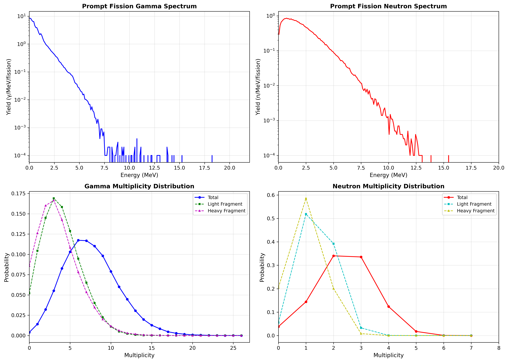

# CGMF_UQ

## Overview

A python wrapper to perform uncertainty quantification within the fission de-excitation code CGMF. Intended for use generating internal model parameter senstivity coefficients against secondary particle observables (PFNS, nubar, etc.). Randomly generated output histories will be generated in the future using sampling across these model parameters to generate randomly perturbed prompt fission gamma spectra.

CGMF is a code which simulates prompt fission neutron and gamma emission from excited fission fragments right after scission using Hauser-Feschbach statistical decay.

**CGMF main repository:** https://github.com/lanl/CGMF

For the purposes of this project, a fork of CGMF has been made which parametrizes gamma strength function 'magic numbers' and places them in `gstrength_gdr_params.dat`.

The purpose of this repository is to provide a wrapper through which randomly perturbed CGMF calculations can be performed. Perturbations are carried out by manipulating `.dat` files within CGMF. Final orchestration scripts are written for a SLURM batch environment.

## Supported Data Files

Model parameters are adjusted by manipulating .dat files within /CGMF/data

This project includes the following specific `.dat` files at the time of writing:

- `gstrength_gdr_params.dat` 
   Gamma strength function and giant dipole resonance parameters
- `tkemodel.dat`
   TKE parameterisation against neutron energy and fragment mass
- `spinscalingmodel.dat`
   Spin cutoff parameters in fragment angular momenta distributions
- `rta.dat` 
   Light-Heavy fragment temperature ratios
- `yamodel.dat` 
   Fragment mass yield parameterisations
- `kcksyst.dat`
   Fragment level density parameterisation 
- `deformations.dat`
   Beta2 deformations of nuclei.

## Project Phases

Full worflow performed in two phases:

1. **Phase 1:** Parameter Sensitivity Testing
2. **Phase 2:** Random Parameter Sampling (COMING SOON)

## How To Run

Comming Soon.

## Results



## Code Architecture
```
PROJECT_ROOT/
├── README.md
├── CGMF_Data_Default/           # Baseline .dat files (Source of Truth)
│   ├── deformations.dat
│   ├── gstrength_gdr_params.dat
│   ├── kcksyst.dat
│   ├── rta.dat
│   ├── spinscalingmodel.dat
│   ├── tkemodel.dat
│   └── yamodel.dat
│
├── cgmf_uq/                     # Core Library Package
│   ├── __init__.py
│   ├── io/                      # Data Handling & Transformation
│   │   ├── __init__.py
│   │   ├── dat_generator.py
│   │   ├── dat_parser.py
│   │   ├── generate_scale_factor_json.py
│   │   ├── param_json_yaml_mapper.py
│   │   └── FILE_PARSERS/        # Low-level regex/parsing logic
│   │       ├── PARSE_deformations.py
│   │       ├── PARSE_gstrength.py
│   │       ├── PARSE_kcksyst.py
│   │       ├── PARSE_rta.py
│   │       ├── PARSE_spinscaling.py
│   │       ├── PARSE_tkemodel.py
│   │       └── PARSE_yamodel.py              
│   │
│   └── slurm/                   # HPC Infrastructure
│       ├── sensitivity_job_template.sh
│       └── SLURM_Single_Job_Generator.py
│
├── config/                      # Global configuration & Metadata
│   ├── Default_Scale_Factors.json
│   ├── Parameter_Registry.yaml
│   └── Sensitivity_Coeff.yaml
│
├── scripts/                     # User entry points & Execution
│   ├── post_processing.py
│   └── submit_sensitivity.py
│
└── tests/                       # Validation & Verification
    ├── dry_test_dat_generator.py
    ├── dry_test_dat_parser.py
    ├── dry_test_manifest_validation.py
    └── test_scale_factors.json
```
